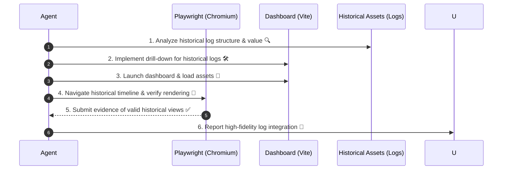

description: 財務価値の最大化と歴史的ログの可視化を優先する検証済みフロントエンドの提供に関する専門的ワークフロー。

---

# フロントエンド検証、更新および専門的ワークフロー

目的: フロントエンドの変更が「Historical Insights (Alpha Trajectories)」を正確に可視化し、投資判断の精度を最大化することを保証する。

背景: 本ワークフローは `/newalphasearch`（自律的アルファ探索）とは独立しており、可視化および監査を専門とする。ユーザーに対して得られた発見結果を最も価値の高い形で提供する方法を扱う。

---

## 1. 履歴ログ活用の戦略定義

履歴データを新しいUIがどのように実用的な洞察へ変換するかを定義する。

- エージェントの指示としては、以下を含むべきである:
  - `implementation_plan.md` には以下の「Historical Log View」要件を必ず盛り込むこと:
    1. 比較可能性: 異なる過去期間や戦略（アルファ）をどの程度容易に比較できるか。
    2. ドリルダウン: 概要サマリーから特定の日次詳細（例: 生データのEDINET提出情報）へシームレスに遷移できること。
    3. 過去の忠実度: 過去から現在までの累積リターンとドローダウンが正確に表示されること。

---

## 2. 堅牢な実装と最終的な型安全性

大量の履歴ログを扱う際には、型安全性と性能が最重要である。

- エージェントの指示として、マッピングロジックには Strict TypeScript を用い、入力の不正性に対しては `Zod` による即時拒否を徹底する。コードの純度を最大限に確保するため、`task check` を実行する。

---

## 3. Playwright を用いた時系列検証

時系列データポイントが自動UIテストで正しく描画されていることを検証する。

- エージェントの指示として、以下を実施する:
  - `ts-agent/src/dashboard` において、`npm run dev` により開発サーバを起動する。
  - Playwright を用いて履歴日付を選択し、日次ログおよびチャートが正しく更新されることを検証する。
  - 履歴アルファ探索の瞬間の画面をキャプチャし、証拠資料として提出する。

---

## 4. 物理ログストレージの同期

ダッシュボードが `logs/` ディレクトリ内の資産と完全に同期していることを確認する。

- エージェントの指示として、以下を実施する:
  - `vite.config.ts` のプロキシ設定が、過去の履歴ログの深い階層レベルを正しく対象としていることを検証する。
  - 1か月前または3か月前のログが即座にインデックス化され、チャートへ反映されることを確認する。

---

## 5. 専門的な報告

`walkthrough.md` において、「Historical Log View」がどのように強化されたかを詳細に記述する。

- エージェントの指示として、事前および事後のスクリーンショットを提供し、報告として以下を提出する:
  - 「1年前の Historical Alpha の挙動は現在完全に透明で、ナビゲーション可能である。」という点の事実関係を明示する。

---

## Mermaid Sequence

> [!IMPORTANT]
> 現在の可視化は標準である。過去を解釈することにより、未来を把握する。