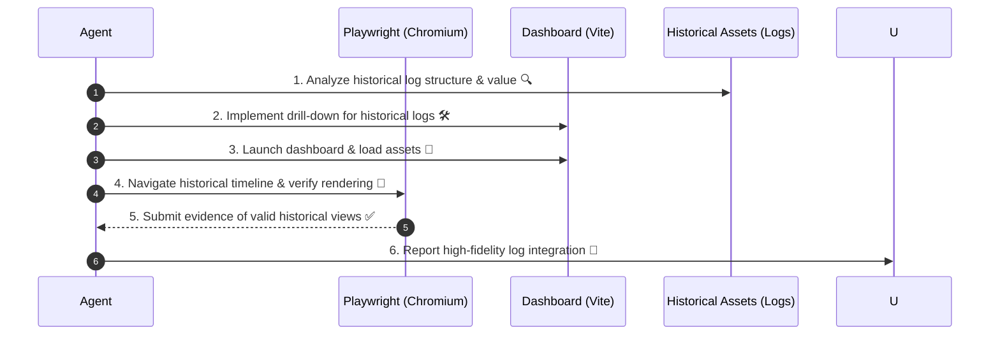

# Frontend Verification, Update & Professional Workflow

Objective: Ensure that frontend modifications perfectly visualize "Historical Insights (Alpha Trajectories)" and maximize the precision of investment decisions.
Context: This workflow is independent of `/newalphasearch` (Autonomous Alpha Discovery) and specializes in Visualization and Audit (Audit/Visualization)—how to deliver discovery results to the user in the most valuable form.

---

## 🤖 Agent Execution Steps

// turbo-all
Execute these steps with a focus on "Historical Log Visualization."

### 1️⃣ Strategic Definition of Historical Log Utilization 🎯
Define how the new UI transforms historical data into "Actionable Insights."
- Agent Prompt:
  - The `implementation_plan.md` must include the following "Historical Log View" requirements:
    1. Comparability: How easily can different historical periods or strategies (Alphas) be compared?
    2. Drill-down: Is there a seamless transition from overview summaries to specific daily details (e.g., raw EDINET filings)?
    3. Historical Fidelity: Are cumulative returns and drawdowns displayed "truthfully" from past to present?

### 2️⃣ Robust Implementation & Ultimate Type Safety 💻
When handling mass historical logs, type safety and performance are paramount.
- Agent Prompt:
  - Use Strict TypeScript for mapping logic and enforce immediate data rejection via `Zod` for any malformed inputs.
  - Execute `task check` to ensure maximum code purity.

### 3️⃣ Time-Series Validation via Playwright 🌐
Verify that historical data points are rendered correctly using automated UI testing.
- Agent Prompt:
  - Start the development server with `npm run dev` in `ts-agent/src/dashboard`.
  - Use Playwright to "Select a Historical Date" and verify the daily logs and charts update correctly.
  - Capture screenshots of historical Alpha discovery moments and submit them as evidence. 📸

### 4️⃣ Physical Log-Storage Synchronization 👀
Ensure the dashboard is 100% synchronized with the assets in the `logs/` directory.
- Agent Prompt:
  - Validate that `vite.config.ts` proxy settings correctly target deep hierarchy levels of historical logs.
  - Confirm that logs from 1 month or 3 months ago are indexed and reflected in the charts immediately.

### 5️⃣ Professional Reporting 🎁
In the `walkthrough.md`, detail how the "Historical Log View" has been enhanced.
- Agent Prompt:
  - Provide before/after screenshots and report: "Historical Alpha behavior from 1 year ago is now fully transparent and navigable! 💎✨"

---

## 🧭 Mermaid Sequence

> [!IMPORTANT]
> Visualizing the "Now" is standard. A professional unlocks the "Future" by decoding the "Past." 💎✨
