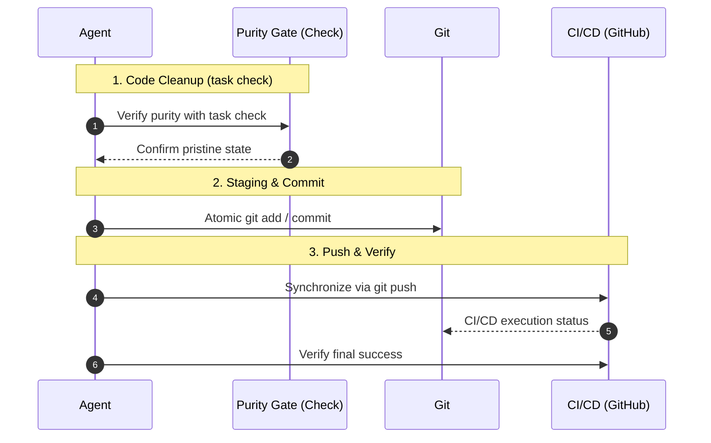

description: 世界最高水準のコード品質を維持し、全チームが円滑に開発を進行できるようにするためのルール。
---

# Git Operations & Professional Cleanup Protocols

目的：コードベースを最高水準の品質状態に維持し、チーム全体の協働を円滑に進めることである。  
背景：乱雑なコードおよび曖昧なコミット履歴を排除し、安全で信頼性の高い開発環境を確保する。

---

## エージェント実行手順

// turbo-all  
以下を順次実行し、各ステップが完了したことを「完了」と表示されるのを確認の上、次へ進む。

### 1. コード純度検証（クリーンアップ）

プロジェクトのルートで `task check` を実行する。  
（これにより `bun run format` および `bun run lint` が呼び出され、コードを清浄な状態に保つ。）

- エージェントへの指示：  
  - エラーが発生した場合、自己修正を最大2回まで試みる権限を有する。  
  - 解決が不可能な場合は、直ちにユーザーへ報告する。

---

# Development Philosophy: Crash-Driven Development (CDD)

速やかに失敗を認識し、重大な結果を伴って失敗する。AIエージェントを専門的同僚として扱い、失敗する権利と事実に向き合う義務の双方を認める。

参考：https://zenn.dev/kafka2306/articles/11cd731eebded1

---

## 基本理念

AI生成コードは、防御的に見えるほど危険性が高まる。例外の抑制は誤った自信を生み出す。スタックトレースは、AIと人間の理解を結ぶ唯一の客観的事実である。

原則：単純性 + 透明性 + インフラの堅牢性 = 真の堅牢性

---

## 規則1：例外処理 — 厳格な最小化

### 必須ルール

1.1 業務ロジックにおける例外処理：禁止  
- アプリケーションの業務ロジックに `try-catch` を使用してはならない。  
- データ変換関数で例外を捕捉・抑制してはならない。  
- 失敗を隠す目的で `None`、`False`、`empty`、またはエラーコードを返してはならない。  
- クラッシュの代替としてログを使用してはならない。

1.2 エラーの連鎖を許容する  
- 予期せぬすべての例外を直ちに伝播させる。  
- 完全なスタックトレースを標準エラー出力または標準出力へ出力する。  
- アプリケーション層で独自のエラーハンドリングを実装してはならない。  
- スタックトレースはフィルタリングなしで完全でなければならない。

1.3 インフラストラクチャ専用のレジリエンス  
- リトライロジックは Makefile、Docker、Kubernetes、またはスケジューラ（Taskfile）に含ませるべきである。  
- タイムアウト機構はインフラストラクチャレベルで管理され、アプリケーションコードには含まれない。  
- ヘルスチェックはアプリケーションロジックの外部で行われるべきである。

---

### 違反の影響

抑制された例外は以下を生み出す。  
- 誤解を招くデバッグ信号（不適切なログ）  
- ルート原因情報の喪失（スタックトレースが破壊される）  
- 隠れた失敗の連鎖（エラーが見えなくなる）  
- AI によるデバッグの困難化（客観的事実が不足する）

---

### 厳格な実装例

```python
# ❌ VIOLATION: Catch-and-suppress pattern
def fetch_user(user_id):
    try:
        response = http_get(f"/users/{user_id}")
        return response.json()
    except Exception as e:
        logger.error(f"User fetch failed: {e}")  # HIDES the real error
        return None  # Returns silence instead of crashing

# ✓ CORRECT: Let the error be seen
def fetch_user(user_id):
    response = http_get(f"/users/{user_id}")  # Crashes if network fails
    return response.json()  # Crashes if JSON parse fails
```

---

## 規則2：スタックトレース — 不変の真実

### 必須ルール

2.1 スタックトレースはデバッグ上の事実  
- スタックトレースを唯一の真実として扱う。  
- スタックトレースを抑制したり省略してはならない。  
- スタックトレースをログメッセージと置換してはならない。  
- 全てのクラッシュは完全なフレーム情報を生成する。

2.2 診断用ログは不十分  
- ログは人間が解釀する物語（主観的）。  
- スタックトレースは機械生成の事実（客観的）。  
- 詳細なログは、欠落したスタックトレースを補完できない。

2.3 根本原因分析はスタックトレースを用いる  
- スタックトレースから源泉へ遡って分析する。  
- ログメッセージから推測してはならない。  
- すべてのデバッグセッションは、完全なクラッシュダンプから開始する。

---

## 規則3：関心の分離 — 厳格な境界の運用

### 必須ルール

3.1 アプリケーション層：業務ロジックのみ  
- リトライ機構、タイムアウトロジック、ヘルスチェック、サーキットブレーカーを含んではならない。  
- エラーを直ちにかつ完全に伝播させる。

3.2 インフラストラクチャ層：レジリエンスのみ  
- Taskfile/Makefile：リトライループ、逐次実行、条件式。  
- Docker：ヘルスチェック、再起動ポリシー、エントリーポイントスクリプト。  
- Systemd：Restart=、RestartSec=、サービス依存関係。  
- モニタリング：アラート、メトリクス収集。

---

### 2️⃣ アトミック保存（Git ステージング＆コミット）

クリーンアップ後、変更を原子的にステージする（最小の論理ユニット）。

- エージェントへの指示：  
  - 複数の機能を1つの `git add .` にまとめてはいけない。  
  - meaningful な原子単位をステージするには `git add -p` または特定のファイルパスを使用する。  
  - 「Documentation」「Logic Fixes」「Refactors」を別々のコミットとして分離する。  
  - 慣例プレフィックスを使用する：`feat:`、`fix:`、`docs:`、`refactor:`、`chore:`。

#### 💡 明確性と機能意図
コミットメッセージは具体的で、達成された機能的価値を記述すべきである。  
技術的な正確さと専門的な明瞭さを併せて持つよう心掛ける。

---

### 3️⃣ グローバル同期（Push & Verify）

最終的に変更を同期するために `git push` を実行する。  
エージェントへの指示：利用可能であれば `gh run list` を使用してCI/CDの「Success」状態を確認する。

---

## 🧭 Mermaid Sequence



> [!TIP]
> A clean history is the evidence of our professional excellence and care.