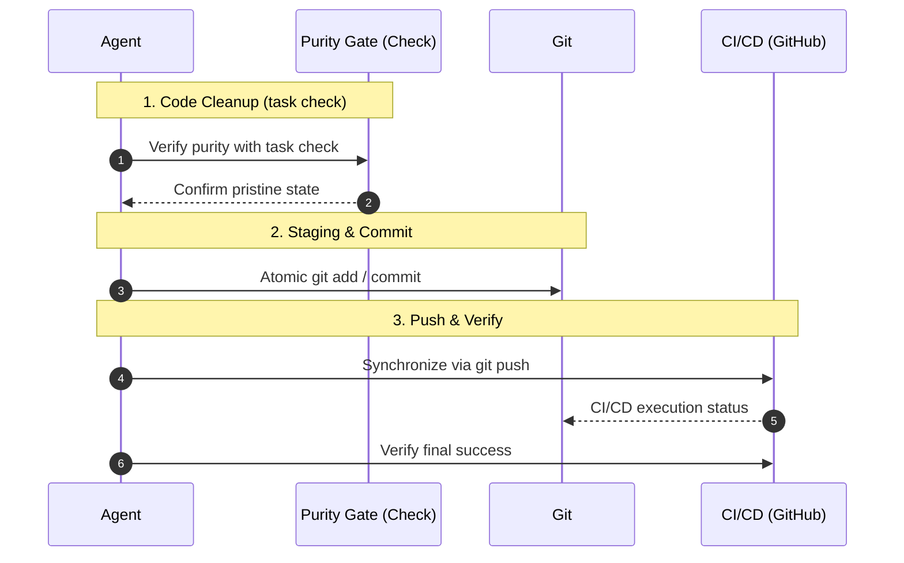

# Git Operations & Professional Cleanup Protocols

Objective: Maintain the codebase in its highest state of purity and ensure seamless collaboration across the team.
Context: To eliminate disorganized code and ambiguous commit histories, ensuring a safe and reliable development environment.

---

## 🤖 Agent Execution Steps

// turbo-all
Follow these steps in sequence, verifying each "Done ✨" before proceeding.

### 1️⃣ Code Purity Verification (Cleanup)
Execute `task check` at the project root.
(This invokes `bun run format` and `bun run lint` to ensure the code is pristine.)
- Agent Prompt: 
  - If errors occur, you are authorized to attempt self-correction up to 2 times.
  - If resolution is not possible, report to the user immediately.

---

# Development Philosophy: Crash-Driven Development (CDD)

Fail Fast, Fail Loud. Treat AI agents as professional colleagues: grant both the right to fail and the obligation to confront facts.

Reference: https://zenn.dev/kafka2306/articles/11cd731eebded1

---

## Core Philosophy

AI-generated code becomes MORE dangerous the more defensive it appears. Exception suppression creates false confidence. Stack traces are the ONLY objective fact connecting AI and human understanding.

Principle: Simplicity + Transparency + Infrastructure Strength = True Robustness

---

## Rule 1: Exception Handling — Strict Minimization

### MANDATORY RULES

1.1 Business Logic Exception Handling: PROHIBITED
- MUST NOT use `try-catch` in application business logic.
- MUST NOT catch and suppress exceptions in data transformation functions.
- MUST NOT return `None`, `False`, `empty`, or error codes to hide failures.
- MUST NOT use logging as a substitute for crashes.

1.2 Let Errors Cascade
- MUST propagate ALL unexpected exceptions immediately.
- MUST output complete stack traces to stderr/stdout.
- MUST NOT implement custom error handling at the application layer.
- Stack traces MUST be unfiltered and complete.

1.3 Infrastructure-Only Resilience
- Retry logic MUST live in Makefile, Docker, Kubernetes, or scheduler (Taskfile).
- Timeout mechanisms MUST be infrastructure-level, NOT application code.
- Health checks MUST be external to application logic.

### VIOLATION CONSEQUENCES
Suppressed exceptions create:
- False debugging signals (misleading logs).
- Lost root cause information (stack traces are destroyed).
- Cascading hidden failures (errors compound invisibly).
- Impossible AI debugging (no objective facts to analyze).

### STRICT IMPLEMENTATION
```python
# ❌ VIOLATION: Catch-and-suppress pattern
def fetch_user(user_id):
    try:
        response = http_get(f"/users/{user_id}")
        return response.json()
    except Exception as e:
        logger.error(f"User fetch failed: {e}")  # HIDES the real error
        return None  # Returns silence instead of crashing

# ✓ CORRECT: Let the error be seen
def fetch_user(user_id):
    response = http_get(f"/users/{user_id}")  # Crashes if network fails
    return response.json()  # Crashes if JSON parse fails
```

---

## Rule 2: Stack Traces — Inviolable Ground Truth

### MANDATORY RULES

2.1 Stack Traces Are Debugging Facts
- MUST treat stack traces as the single source of truth.
- MUST never suppress or abbreviate stack traces.
- MUST NOT replace stack traces with log messages.
- Every crash MUST produce complete frame information.

2.2 Diagnostic Logging is INSUFFICIENT
- Logs are human-interpreted narratives (subjective).
- Stack traces are machine-generated facts (objective).
- Detailed logging CANNOT compensate for missing stack traces.

2.3 Root Cause Analysis Uses Stack Traces
- MUST analyze from stack trace backward to source.
- MUST NOT speculate from log messages.
- Every debugging session MUST start with the full crash dump.

---

## Rule 3: Separation of Concerns — Strict Boundary Enforcement

### MANDATORY RULES

3.1 Application Layer: Business Logic ONLY
- MUST contain NO retry mechanisms, NO timeout logic, NO health checks, and NO circuit breakers.
- MUST propagate errors immediately and completely.

3.2 Infrastructure Layer: Resilience ONLY
- Taskfile/Makefile: Retry loops, sequential execution, conditional logic.
- Docker: Health checks, restart policies, entrypoint scripts.
- Systemd: `Restart=`, `RestartSec=`, service dependencies.
- Monitoring: Alerting, metrics collection.

---

### 2️⃣ Atomic Preservation (Git Staging & Commit)
Once cleaned, stage changes atomically (minimal logical units).
- Agent Prompt:
  - DO NOT bundle multiple features into a single `git add .`.
  - Use `git add -p` or specific file paths to stage meaningful atomic units.
  - Separate "Documentation," "Logic Fixes," and "Refactors" into distinct commits.
  - Use conventional prefixes: `feat:`, `fix:`, `docs:`, `refactor:`, `chore:`.

#### 💡 Specificity & Functional Intent
Commit messages MUST be specific and describe the functional value achieved.
- Combine technical precision with professional clarity.

### 3️⃣ Global Synchronization (Push & Verify)
Finally, execute `git push` to synchronize changes.
- Agent Prompt:
  - If available, use `gh run list` to verify CI/CD "Success" status.

---

## 🧭 Mermaid Sequence


> [!TIP]
> A clean history is the evidence of our professional excellence and care.