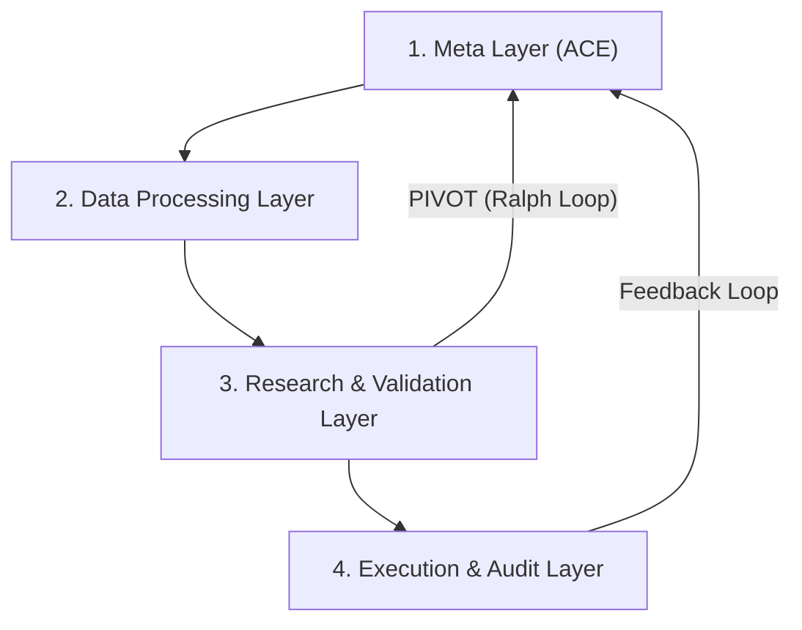

description: Autonomous Alpha Research Trading System (AAARTS) workflow using 4-layer guardrails, GO/HOLD/PIVOT logic, and the Ralph Loop to discover orthogonal alpha signals.

---

# 自律型アルファ研究取引システム（AAARTS）ワークフロー

目的: AAARTSの知性サイクルを活用して、独自の「正交アルファ」を発見し、投資システムの自律的進化を確保する。

背景: アルファ発見プロセスを自動化し、市場条件の変化に対して手動介入なしに適応する。

---

## AAARTS：4層ガードレール

本ワークフローは、品質の高いアルファ信号を提供するため、4つの論理的層にわたって機能する。

---

## エントリポイント

*   標準実行: `task run:newalphasearch`（ループが必要）—検索エンジンは複数サイクルにわたりアルファを探索するよう設計されているため。
*   継続的進化: `task run:newalphasearch:loop`—市場条件は常に変化するため、システムはリアルタイムで適応する必要がある。
*   自然言語入力: `task run:newalphasearch:nl`—人間の直感およびテーマアイデアを自律的探索のシードとして活用できるようにする。

---

## 監査: GO / HOLD / PIVOT

各サイクルにおいて、アルファ候補は8項目の厳格な監査を受ける。品質の低いファクターを本番に展開すると、重大な財務的損失につながる可能性がある。

1. 解釈の一貫性: 実装コードが意図したロジックを実際に実装していること。
2. 仮説の妥当性: 経済的根拠がなければ、信号は統計的ノイズに過ぎない可能性がある。
3. 指標閾値: 高いシャープレシオおよびIC基準を満たす「エリート」アルファのみを展開する。
4. 直交性: 冗長な信号は付加的価値を生まず、取引回転コストを増加させる。
5. データの整合性: NaN値や不良データはバックテスト結果を歪める。
6. リスク感度: 隠れた尾部リスクは、一日で月間の利益を消失させる可能性がある。
7. 実装可能性: 実市場で実行不能なアルファは無価値である。
8. 判定: GO（実行）、HOLD（検証）、PIVOT（再設計）

> [!TIP]
> Ralph Loop: 連続する探索サイクルが失敗（HOLD）した場合は、現在のドメインには容易なアルファが枯渇した可能性が高いため、PIVOTを発令する。

---

## 安全ポリシー

*   閾値を超えた場合は直ちに停止を発動する。腐敗した状態が伝播するよりも、停止する方が望ましい。
*   システム状態は標準出力へブロードキャストされる。運用者はサイクル終了の理由を理解するためのリアルタイムのテレメトリを必要とする。
*   停止したサイクルを再開するには手動介入が必要である。安全性の breachesは根本原因を示しており、エージェントが自律的に修正できない可能性がある。