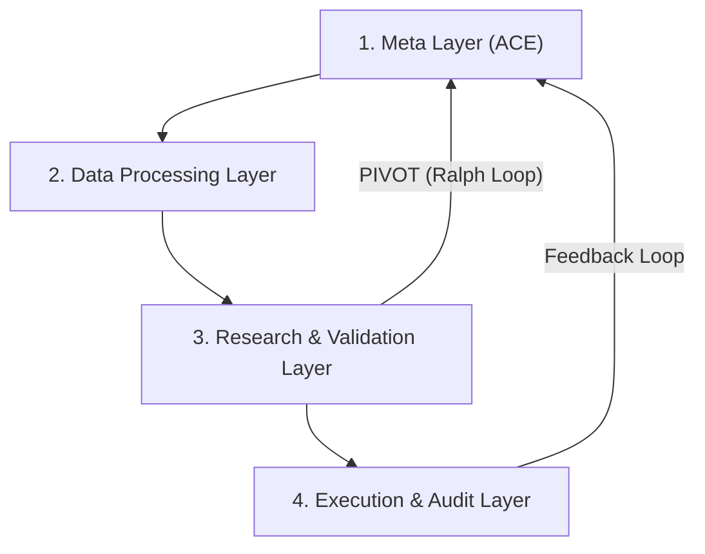

# Autonomous Alpha Research Trading System (AAARTS) Workflow

Objective: Leverage the AAARTS intelligence cycle to discover unique "orthogonal alpha" and ensure the autonomous evolution of the investment system.

Context: Automating the alpha discovery process to adapt to changing market conditions without manual intervention.

---

## 🏗️ AAARTS: 4-Layer Guardrails 🏗️

This workflow operates across four logical layers to deliver high-quality alpha signals:

---

## 🚀 Entrypoints 🚀

*   🏃‍♀️ Standard Execution: `task run:newalphasearch` (Loop required) because the search engine is designed to find alpha over multi-cycle iterations.
*   ♾️ Continuous Evolution: `task run:newalphasearch:loop` because market conditions change constantly and the system must adapt in real-time.
*   🗣️ Natural Language Input: `task run:newalphasearch:nl` because human intuition and thematic ideas should be able to seed the autonomous search.

---

## ⚖️ Audit: GO / HOLD / PIVOT ⚖️

Each cycle subjects alpha candidates to a rigorous 8-point audit because deploying a low-quality factor to production can lead to significant financial loss.

1.  Interpretation Consistency: Because the code must actually implement the intended logic. 🧩
2.  Hypothesis Validity: Because without economic rationale, the signal is likely just statistical noise. 🧠
3.  Metric Thresholds: Because we only deploy "Elite" alpha that meets our high Sharpe and IC standards. 📈
4.  Orthogonality: Because redundant signals do not add marginal value and increase turnover cost. 🌈
5.  Data Integrity: Because NaN values or bad data will corrupt the backtest results. 🛠️
6.  Risk Sensitivity: Because hidden tail risk can wipe out months of gains in a single day. 🛡️
7.  Implementation Feasibility: Because an alpha that cannot be executed in the real market is worthless. 🚀
8.  Verdict: GO (Execute), HOLD (Validate), PIVOT (Redesign)

> [!TIP]
> Ralph Loop: If consecutive search cycles fail (HOLD), trigger a PIVOT because the current domain has likely been exhausted of easy alpha.

---

## 🛡️ Safety Policy 🛡️

*   Threshold breaches trigger immediate termination because stopping the system is better than letting a corrupted state propagate.
*   System state is broadcast to stdout because operators need real-time telemetry to understand why a cycle ended.
*   Manual intervention is required to restart a terminated cycle because a safety breach indicates a root cause that an agent may not be able to fix autonomously.
