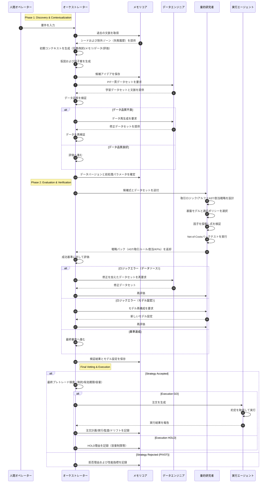
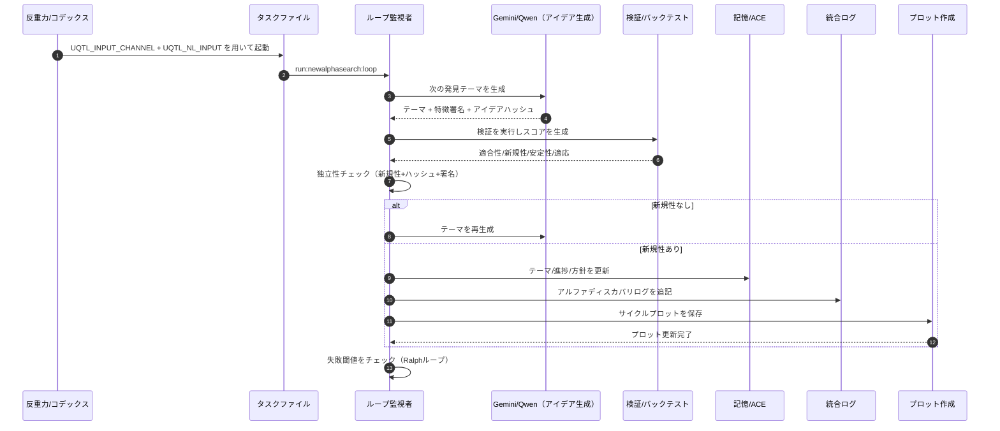

# Autonomous Quant Logic Sequence (Operational Ideal)

**Objective**: アルファ生成からオーダー実行までのエージェント間の相互作用の構造設計図を確立する。  
**Context**: 運用上の曖昧さを排除し、完全に自律的で自己改善可能なパイプラインを構築する。

## Executive Summary
本稿は、Gemini 3.0 Proと専門エージェント間の相互作用サイクルを概説する。アイデア創出、Point-In-Time（PIT）データのキュレーション、ASTベースの戦略設計、Net-of-Costsバックテストといったエンドツーエンドのプロセスを網羅する。本手法は、計算のすべての秒を有効なアルファの発見と展開へ向けて活用することを保証する。

---

## Autonomous Quant Logic Sequence (Ideal Architecture)

このダイアグラムは、高度な自律運用を達成するための局所標準を表す。

## Structural Enhancements
1. **Pre-emptive Context**: 実行前に要件と履歴を整合させ、冗長な計算を最小化する。  
2. **Knowledge Archival**: 候補を早期に保存し、後の取得およびアイデア間の相互参照を容易にする。  
3. **Reproducibility**: データと前処理パラメータをバージョン管理し、バックテスト結果の一貫性を保証する。  
4. **Integrated Design**: 取引ロジック、アルファ、アロケーションは、全体システムの性能を最大化するよう相互依存的に設計される。  
5. **Value in Rejection**: 拒否の理由は、次の探索反復における高価値データとして扱われる。  

---

## 🎯 Core Alpha Discovery Loop (Operational Minimum)
> 詳細は、`docs/specs/alpha_discovery_runbook.md` および `docs/specs/autonomous.md` を参照のこと。

