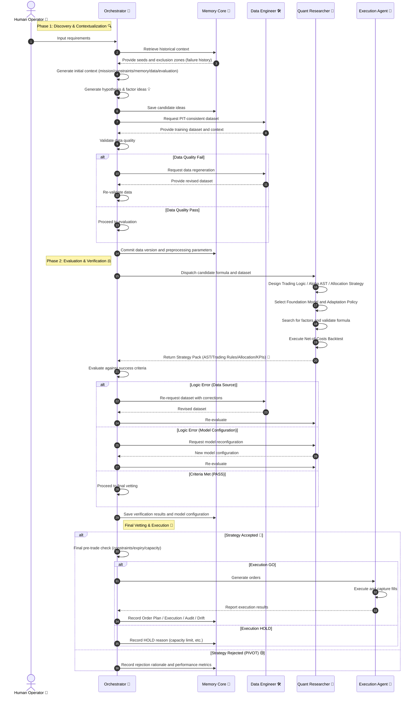
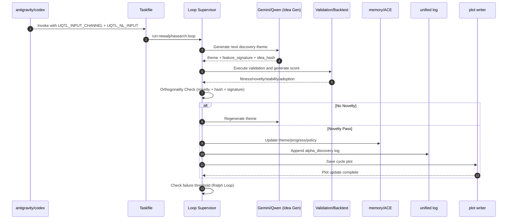

# Autonomous Quant Logic Sequence (Operational Ideal)

**Objective**: Establish a structural blueprint for the interaction between agents, from alpha generation to order execution.
**Context**: To eliminate operational ambiguity and create a fully autonomous, self-improving pipeline.

## Executive Summary
This document outlines the interaction cycle between Gemini 3.0 Pro and specialized agents. It covers the end-to-end process: idea generation, Point-In-Time (PIT) data curation, AST-based strategy design, and Net-of-Costs backtesting. This recipe ensures every second of computation is directed toward discovering and deploying valid alpha.

---

## Autonomous Quant Logic Sequence (Ideal Architecture)

This diagram represents the localized standard for high-autonomy operations.

## Structural Enhancements 💡
1. **Pre-emptive Context**: Orchestrator aligns requirements and history before execution to minimize redundant computation.
2. **Knowledge Archival**: Candidates are saved early to enable later retrieval and "cross-pollination" of ideas.
3. **Reproducibility**: Preprocessing parameters are versioned alongside data to ensure consistent backtest results.
4. **Integrated Design**: Trading logic, alpha, and allocation are designed co-dependently to maximize total system performance.
5. **Value in Rejection**: Rejection rationales are treated as high-value data for the next search iteration.

---

## 🎯 Core Alpha Discovery Loop (Operational Minimum)
> See `docs/specs/alpha_discovery_runbook.md` and `docs/specs/autonomous.md` for details.

