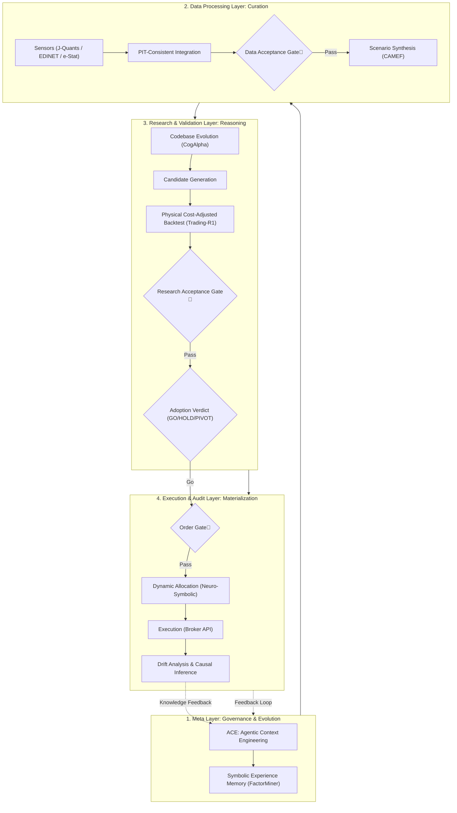

# AAARTS: The Logical Structure of a Self-Evolving Alpha Search & Execution System

**Objective**: Define the architecture for a system that integrates alpha research and execution into a single, unified intelligence loop capable of adapting to market decay.

---

## 1. Observation: Why Theoretical Alpha "Decays"

AAARTS treats the disappearance of alpha not as a "problem" but as a primary "environmental condition" to be managed.

- **Alpha Decay**: The observation of a valid strategy triggers imitation and overcrowding, causing returns to converge toward execution costs.
- **Redundant Exploration**: Most search algorithms are structurally biased, leading to hypothesis overlap.
- **Execution Friction**: There is a persistent gap between theoretical (gross) and realized (net) returns due to liquidity and latency.

---

## 2. Architecture: The "4-Layer Guardrails"

AAARTS utilizes four independent logical layers to guarantee the quality of outcomes from research to execution.

---

## 3. Governance: Standard Audit (REASON_DESC.md)

Every decision in the AAARTS cycle—specifically rejection or PIVOT—is categorized using the 8-point standardized reason system defined in [REASON_DESC.md](file:///home/kafka/finance/investor/.agent/workflows/REASON_DESC.md).

| Item | Focus Area | Standard Category [REASON_DESC.md] |
| :--- | :--- | :--- |
| **Observation** | Point-in-Time data consistency. | **5. Data Integrity** |
| **Interpretation** | Logic-to-code mapping integrity. | **1. Interpretation Consistency** |
| **Hypothesis** | Economic and causal rationale. | **2. Hypothesis Validity** |
| **Novelty** | Distinctiveness from playbook patterns. | **4. Orthogonality & Novelty** |
| **Performance** | Sharpe, IC, and MDD thresholds. | **3. Metric Thresholds** |
| **Risk** | Proximity to "Forbidden Zones." | **6. Risk Sensitivity** |
| **Feasibility** | Execution and liquidity constraints. | **7. Implementation Feasibility** |
| **Verdict** | Final GO / HOLD / PIVOT action. | **8. Verdict Rationale** |

---

## 4. The Self-Evolution Cycle (Ralph Loop)

The core strength of AAARTS is its ability to observe its own outputs and feedback failures into the next cycle's inputs.

1.  **Cognitive Synthesis**: Synthesizes new hypotheses that logically avoid previous "rejection reasons."
2.  **Evolutionary Recombination**: Recombines successful Alpha trajectories to explore the optimal solution space.
3.  **Causal Filtering**: Uses counterfactual simulations to eliminate spurious correlations.
4.  **Self-Correction**: Triggers a **Domain Pivot (Ralph Loop)** when consecutive failures are detected, effectively relocating the search to an unsaturated domain.

---

## 5. Decision Evidence: The Triple Fingerprint

To ensure trust in autonomous decisions, every action is tagged with:
1.  **Logical Fingerprint**: Immutable hash of the executed program code (AST).
2.  **Reasoning Fingerprint**: Full Chain-of-Thought (CoT) trace that led to the result.
3.  **Environment Fingerprint**: Snapshot of the dataset, liquidity, and market regime during execution.

---

# Conclusion
AAARTS is not merely a profit-seeking engine; it is an **"Adapting Intelligence."** Through ACE (Agentic Context Engineering), it learns to love its failures, synthesizing wisdom from rejections to evolve in the complex system of financial markets.
