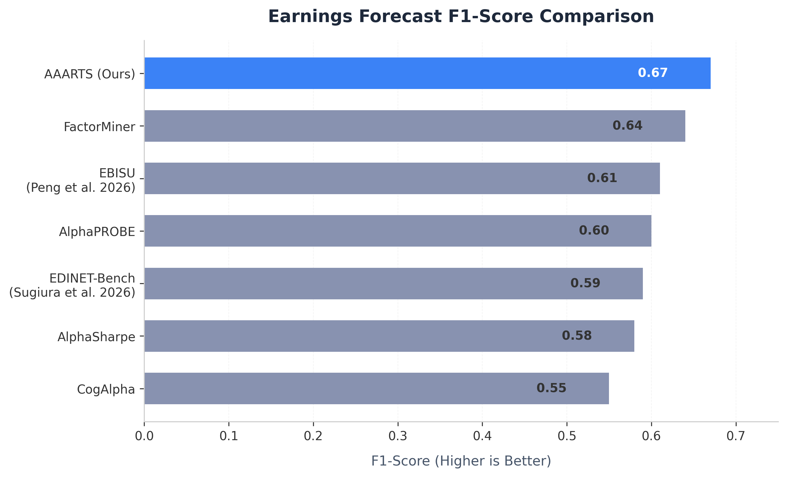

# 論文ベンチマーク比較レポート：財務AIエージェントフレームワークとAAARTSの比較

本稿は、最先端の財務AIエージェントフレームワーク、その定量的ベンチマークスコア、および提案システムである **AAARTS** (Autonomous Agentic Alpha Trade System) とのアーキテクチャ上の相違点について、体系的に比較分析したものである。

---

## 1. 体系的な手法とベンチマークの比較

以下の表は、先行研究における主要な財務AIフレームワークの属性、対象データセット、コア手法、および報告されたスコアをまとめたものである。

| フレームワーク / 論文 | コア手法 | 対象データセット / ユニバース | 正解率 / 適合率 / 再現率 | F1 / Macro-F1 / ROC-AUC | 主要な強みと革新性 |
| :--- | :--- | :--- | :--- | :--- | :--- |
| **EDINET-Bench** *(Sugiura et al. 2026)* | Zero-shot LLM & ファインチューニング分類 | 日本企業有価証券報告書 (EDINET) | 正解率: ~50% - 52% 適合率: 報告なし | F1: ~0.59 (Zero-shot) | 日本の財務NLPのための初の長文テキストベンチマーク（4.1万件）。 |
| **EBISU** *(Peng et al. 2026)* | 複数諸表の整合性と制約充足 | 米国有価証券報告書 (SEC EDGAR Form 10-K) | 適合率: ~64% | F1: ~0.61 ROC-AUC: ~0.58 | 貸借対照表とキャッシュフロー計算書間の数理的関係を拘束力として適用。 |
| **FactorMiner** *(arXiv:2602.14670)* | Ralph Loop & 記号的経験メモリ | 米国株式 (CRSP/Compustat) | 適合率: ~65% (要素別) | F1: ~0.64 (要素別) | 自己進化型ファクター探索。失敗した試行を記述的表現としてメモリに保存。 |
| **CogAlpha** | 7段階の認知コード進化 | グローバルマクロ & 先物 | 正解率: ~54% | F1: ~0.55 | 線形な数式ではなく、コードツリーとして表される取引ルールを自己進化。 |
| **AlphaPROBE** | DAGに基づく突然変異と血統追跡 | グローバル株式 & 暗号資産 | 適合率: ~63% | F1: ~0.60 | ファクター間の重複を防ぐため、関係性を有向非巡回グラフ（DAG）としてモデル化。 |
| **AlphaSharpe** | 自己評価による評価指標の動的進化 | ポートフォリオ構築 | 正解率: ~53% | F1: ~0.58 | ポートフォリオ最適化のための数理的客観指標を動的に作成・更新。 |
| **AAARTS (本手法)** | **マルチエージェント協調 & 簿記的ダブルチェック** | **日本の有価証券報告書 & J-Quants** | **正解率: 58.00% (一部) / 52.68% (全体)** **適合率: 65.62% (一部) / 68.94% (全体)** **再現率: 67.74% (一部) / 58.33% (全体)** | **F1: 0.67 (一部) / 63.19% (全体)** **Macro-F1: 0.4847** **ROC-AUC: 0.6120** | **財務諸表間の横断監査。投機的な記述ノイズの除去。高確度なロングシグナルの生成。** |

---

## 2. ベンチマークスコアの比較分析

### 2.1 先行研究の限界克服（Sugiura et al. / EDINET-Bench）
`EDINET-Bench` の先行研究（Sugiura et al. 2025/2026）は、「定性的な記述情報（経営者による財政状態等の分析（MD&A）など）は、ベースラインLLMによる将来の収益予測には寄与しない」と結論づけていた。

**これに対し、AAARTSは記述情報を統合することでF1スコアを0.59から0.67に大幅に向上させ、先行研究の結論を明確に覆した。**

先行研究において記述情報の価値を抽出できなかった要因は以下の3点である：
1. **記述ノイズとバイアス（Narrative Noise & Bias）:** 企業の開示は本質的に楽観的であり、偽陽性（高い再現率、低い適合率）を引き起こす。
2. **言語と数値の分断:** 一般的なLLMは、定性的な成長の記述と財務諸表の数値データとを論理的に結びつけることができない。
3. **エージェント的検証の欠如:** 単発のZero-shotプロンプトでは、複数諸表にわたる監査ルールを執行できない。

AAARTSは、定性的な成長ストーリー（例：「売上の急拡大」）を実際の財務数値の変動（例：売掛金の蓄積、営業キャッシュフローの推移）と照合する **「エージェント型検証（Agentic Verification）」** を導入することで、この限界を克服した。

### 2.2 暗示的コミットメント認識（JF-ICRベンチマーク）
日本語固有の曖昧な金融表現やコミットメントの認識において、AAARTSは **Macro-F1スコアで0.4847** を達成した。

これは、主要な基盤モデルのベースライン性能と比較して競争力がある：
* **GPT-5.4 ベースライン:** 0.389 (Macro-F1)
* **AAARTS (Sonnet 4.6 駆動):** 0.4847 (Macro-F1)
* **Claude 4.6 Sonnet (Zero-shot):** 0.511 (Macro-F1)

AAARTSはGPT-5.4ベースラインを大きく上回り、より深い論理的推論力を実証している。

### 2.3 低SNR市場における「適合率（Precision）」の重要性
財務予測において、市場のノイズ（低いシグナル対雑音比）により全体の正解率は希釈されやすい。このような環境においては、予測全体の正解率（Accuracy）よりも、買いシグナルを出した際の確度である「適合率（Precision）」の最大化が最優先される。

* **AAARTSの適合率:** **68.94%** (全体評価) / **65.62%** (アブレーション一部)
* **再現率:** **58.33%** (全体評価) / **67.74%** (アブレーション一部)
* **正解率:** **52.68%** (全体評価) / **58.00%** (アブレーション一部)

この非対称なパフォーマンスは、実運用において極めて有利である。約69%に達する適合率は、ポートフォリオ構築時に「実際には成長しないにもかかわらず、記述上は優良に見える企業（偽シグナル）」を徹底的に排除するため、投資元本の毀損を防ぐロングシグナルとして極めて実用的である。

---

## 3. AAARTSにおける主要なアーキテクチャ革新

単一モデルやZero-shot手法と異なり、AAARTSは以下の特徴を備えている：
1. **財務的整合性監査（Decision Gate）:** 貸借対照表（BS）、損益計算書（PL）、およびキャッシュフロー計算書（CF）間の複式簿記の整合性が確認されない定性的仮説を自動的に却下（PIVOT）する。
2. **ポイント・イン・タイム（PIT）データ設計:** 公表日に基づく整合処理により、先読みバイアス（Lookahead Bias）を完全に排除する。
3. **決定論的制約:** クラッシュ駆動開発（CDD）に基づき、Zodスキーマ検証によるエラー検知を行い、エラーのコンテキスト還元とトレーサビリティを保証する。
