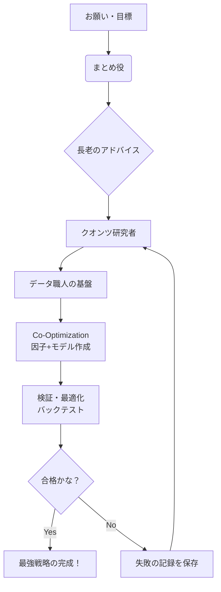

# 最高の R&D-Agent-Quant 研究室

**タイトル**: R&D-Agent-Quant: 因子とモデルを共に育成する、協調型マルチエージェント・フレームワーク  
**目的**: アルファ（高いリターンのサイン）の探索を、データ（因子）とモデル（構築手法）の双方から同時に自動化すること  
**解決すべき課題**: 因子を特定した後、適切なモデルを選択して動作させる手法が不明であるという課題を解消し、最適な組み合わせを自動で特定すること

## エグゼクティブサマリー
本プロジェクトは、AIエージェントがチームを形成し、クオンツ投資の研究開発を自動化する取り組みである。従来は因子の抽出と予測モデルの構築を別個に扱うことが多いが、共最適化（Co-Optimization）を適用することにより、両者を同時に最適化する点が最大の特徴である。人間の介在を介さず、高速かつ高品質な投資戦略の自動生成を可能にする、将来性のある取り組みである。

---

## 論文の精読
最新の知見を含む論文は以下のとおりである。チェックしてほしい。

*   arXiv: [https://arxiv.org/abs/2505.15155](https://arxiv.org/abs/2505.15155)  
*   alphaXiv (JA): [https://www.alphaxiv.org/abs/2505.15155?lang=ja](https://www.alphaxiv.org/abs/2505.15155?lang=ja)

---

## 考え方の進化
これまでアルファの探索のみが中心だったが、今後は自律型のR&D部門をAIエージェントで構築する時代となる。24時間体制での運用が想定され、実務的にはクオンツチームが常時機能している状態に近づく。

---

## ここがすごい！3つの特徴
1.  共最適化（因子とモデルの同時最適化）  
    因子だけでなく、それを用いたモデルも同時に最適化する。全体最適な戦略の完成を目指す。
2.  マルチエージェント協調  
    研究者、エンジニア、テスト担当のAIエージェントが協力して、迅速に開発を進める。
3.  エンドツーエンドの自動化  
    データの準備から、難解な計算、検証までを一貫して自動化する。

---

## Gen 4 への効果
*   戦略の完成度が向上する。因子単体ではなく、システム全体の性能が向上し、アルファの品質が高まる。  
*   高速な検証と実行が実現される。人間が数週間かけて行う研究を、短時間で完了できる。

---

## リポジトリ実装への留意点
システムを構築する際の、主要な役割分担と流れを整理する。

### 役割の最小構成（エージェント）
*   人間の担当者: 最終的な意思決定を行う、チームのリーダー
*   まとめ役（オーケストレータ）: 役割を割り振る、統括者
*   アドバイザー: 困難に直面した際の助言を提供する
*   データ担当エンジニア: 市場データ基盤を支える技術者
*   クオンツ研究者: 新しいアイデアを提案・評価する研究者
*   実行担当者: コードを実行して検証する担当者

### お仕事の手順
1.  指示を入力する  
2.  過去の履歴を参照する  
3.  新規アイデアを創出する  
4.  データとモデルを同時に実装する  
5.  厳密な検証（バックテスト）を実施する  
6.  成果が適合すれば実行し、そうでなければ記録を残して次に活かす

### ワークフローの図解（Mermaid）
システムの動作を一目で理解できるようにした。

共最適化・評価・バックテストは、この図のとおり「検証・最適化」として統合して表現すると、見やすく整理される。