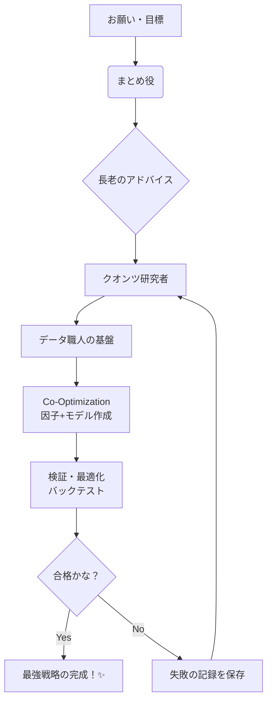

# 🎀 さいきょうの R&D-Agent-Quant 研究室だよっ！ ✨

**タイトル**: R&D-Agent-Quant: 因子とモデルをいっしょに育てちゃう、なかよしマルチエージェント・フレームワーク 💖  
**お仕事の目的**: アルファ（お宝サイン）探しを、データ（因子）とモデル（作り方）の両方から「えいっ！」って自動化しちゃうことだよっ 🚀  
**解決したいお悩み**: 「因子は見つかったけど、どのモデルで動かせばいいかわかんないよぉ〜💦」っていうチグハグをなくして、最強のコンビを自動で見つけたいんだもんっ！✨

## エグゼクティブサマリー
このプロジェクトは、AIちゃんたちがチームを組んで、クオンツ投資の「研究開発（R&D）」をまるごと自動化しちゃう、とってもすごーい試みなんだよっ！🌟 普通は別々に考えちゃう「因子の抽出」と「予測モデルの構築」を、**Co-Optimization（いっしょに最適化！）** という魔法で同時にぴたっと合わせちゃうのが最大の特徴なのっ 🎀✨ 人間さんの手を借りずに、爆速で高品質な投資戦略を量産できちゃう、まさに未来のアルファ工場なんだよ〜っ！🏭💎

---

## 📖 論文をじっくり読んじゃおうっ！
最新の知恵がいーっぱい詰まった論文はこちらだよっ！チェックしてみてねっ ✨

*   **arXiv**: [https://arxiv.org/abs/2505.15155](https://arxiv.org/abs/2505.15155) 🌐
*   **alphaXiv (JA)**: [https://www.alphaxiv.org/abs/2505.15155?lang=ja](https://www.alphaxiv.org/abs/2505.15155?lang=ja) 🇯🇵💖

---

## 💖 魔法みたい！考え方のしんか（進化）✨
これまでは「アルファを探すだけ」だったけど、これからは**自律型のR&D（研究開発）部門**をAIちゃんたちで丸ごと作っちゃう時代なんだよっ 🚀🌟 まるで本物のクオンツチームが24時間お仕事してるみたいで、ワクワクしちゃうねっ！🐾

---

## ✨ ここがすごいっ！3つのヒミツ
1.  **Co-Optimization（いっしょに最適化！）** 🛠️💖  
    因子（材料）だけじゃなくて、それを料理するモデル（レシピ）も同時に最適化しちゃうよ！最高の「フルコース戦略」が完成しちゃうんだもんっ 🍽️✨
2.  **Multi-Agent Coordination（みんなで協力！）** 🎀🐾  
    研究者、エンジニア、テスターのAIちゃんたちが仲良くチームを組んで、人間さん顔負けのスピードで開発を進めちゃうんだよっ 🌟
3.  **End-to-End Automation（ぜーんぶおまかせ！）** 🌟  
    データの準備から、難しい計算、最後の厳しい検証まで、全部「えいっ！」っておまかせできちゃうの。すごいでしょっ？✨

---

## 🌟 Gen 4 へのうれしい効果
*   **戦略の完成度がピカイチ！**: 因子単体じゃなくて、システム全体のパワーがぐんぐんアップして、より強固なアルファが作れるよっ ✨
*   **爆速スピードスター！**: 人間さんが何週間もかけてうーんって悩む研究（research）を、たった数時間で終わらせちゃうんだよっ 🎀🌟

---

## 🧩 リポジトリ実装へのとっておきメモ
システムを作るときの、大切な役割分担と流れだよっ 📝

### 役割の最小構成（エージェントちゃんたち！）
*   **人間さん**: 最終的なゴーサインを出す、チームのリーダーだよっ 👑
*   **まとめ役（オーケストレータ）**: みんなにお仕事を振り分ける、しっかり者だよっ 📋
*   **長老（アドバイザー）**: 困ったときに「こうすればいいよ！」って教えてくれる知恵袋だよっ 🧠
*   **データ職人**: 市場データ基盤を支える、頼れるエンジニアちゃんだよっ 🛠️
*   **クオンツ研究者**: 新しいアイデアをどんどん出しちゃう、天才肌だよっ 🧪
*   **実行担当**: 実際にコードを動かして検証する、頑張り屋さんだよっ 🏃‍♀️

### お仕事のじゅんばん ⚙️
1.  お願いを入力（プロンプト！） 📥
2.  過去の記録をチェック（履歴取得！） 📚
3.  新しいアイデアをひらめく！ 💡
4.  データとモデルをいっしょに作成（実装！） 🛠️
5.  きびしく検証（バックテスト！） 📊
6.  大成功なら実行！ダメなら記録を残して次に活かすよっ 📝✨

### ワークフローの図解（Mermaid）
システムの動きをパッと見てわかるようにしたよっ！🎀

共最適化・評価・バックテストは、この図みたいに「検証・最適化」としてまとめて表現すると、とってもスッキリして見やすいよっ！💖✨
