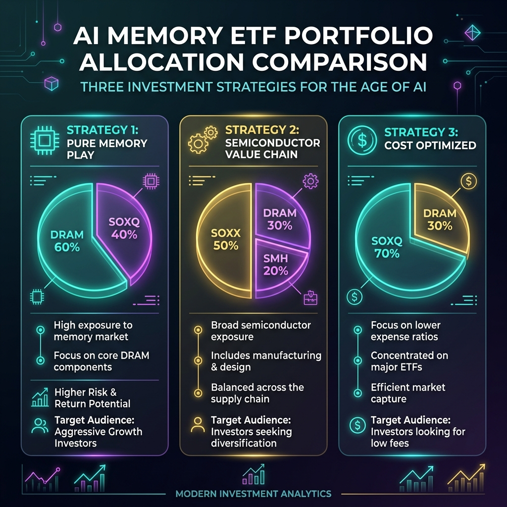

# AIメモリ（DRAM・NAND・HBM）関連指数・ETFの投資テーマ最適化レポート

## 1. 投資テーマと市場背景（2026年現在の展望）
AIモデルの巨大化（LLMのパラメータ数増加、およびオンデバイスAIの普及）に伴い、半導体市場のボトルネックは演算処理能力（GPU）から**データ転送帯域およびメモリ容量（HBM、高帯域幅メモリ）**へとシフトしている。
本レポートでは、「HBM不足・DRAM価格高騰・AIデータセンター需要爆発」というテーマに対し、各指数・ETFがどの程度直接的な投資対象となり得るかを分析し、ポートフォリオ構築の最適化指針を提示する。

---

## 2. 対象指数・ETFの定量的・定性的プロファイル

### 2.1 AIメモリ純粋特化（Pure-Play）
*   **Roundhill Memory ETF (ティッカー: DRAM)**
    *   **経費率:** 0.45%（推定）
    *   **特徴:** 2026年新設。DRAM・NAND・HBMの主要3社（SK hynix、Samsung Electronics、Micron Technology）に集中的に投資する市場唯一のメモリ特化型ETF。
    *   **テーマ適合度:** ★★★★★（最高）
    *   **投資適性:** メモリ価格のボラティリティと価格高騰の恩恵を最も直接的に享受できる。

### 2.2 半導体セクター広範型（Broad Semiconductor）
*   **NASDAQ US Smart Semiconductor Index (SOXQの連動対象)**
    *   **ティッカー:** SOXQ (Invesco PHLX Semiconductor ETF)
    *   **経費率:** 0.19%（業界最低水準）
    *   **特徴:** 浮動株調整時価総額加重ではなく、スマートベータ（モメンタムや財務指標）加味のインデックス。Micronなどのメモリメーカーの比率が相対的に高まりやすい設計。
    *   **テーマ適合度:** ★★★★☆
    *   **投資適性:** コスト効率が極めて高く、メモリ比率を高めたバランス型投資に適する。

*   **iShares Semiconductor ETF (SOXX)**
    *   **経費率:** 0.35%
    *   **特徴:** ICE Semiconductor Indexに連動。時価総額上位30社に分散。Micronや製造装置メーカー（Applied Materials、Lam Researchなど、メモリ製造に不可欠なEUV/DRAM用装置）の比率がSMHより高い。
    *   **テーマ適合度:** ★★★★☆
    *   **投資適性:** メモリ製造のサプライチェーン全体（装置・材料）を含めた投資に最適。

*   **VanEck Semiconductor ETF (SMH)**
    *   **経費率:** 0.35%
    *   **特徴:** MVIS US Listed Semiconductor 25 Indexに連動。NVIDIAやTSMCなどの超大型株への集中度が極めて高い（NVIDIAが最大20%超を占める場合がある）。
    *   **テーマ適合度:** ★★★☆☆
    *   **投資適性:** GPU（演算器）および最先端ファウンドリ（受託製造）が主役であり、メモリ単体の純粋度は薄まる。

*   **Philadelphia Semiconductor Index (SOX指数)**
    *   **特徴:** 市場全体のインデックス。個別株の組入上限が制限されているものの、半導体業界全体のセンチメントを測るベンチマーク。
    *   **テーマ適合度:** ★★★☆☆

*   **SPDR S&P Semiconductor ETF (XSD)**
    *   **経費率:** 0.35%
    *   **特徴:** 等金額加重平均型。時価総額に関わらず全構成銘柄に均等配分するため、中小型の設計会社（ファブレス）やニッチな半導体企業の比率が高まる。
    *   **テーマ適合度:** ★★☆☆☆（メモリ特化としては不適）

*   **Invesco Dynamic Semiconductors ETF (PSI / FTXL)**
    *   **経費率:** 0.56%
    *   **特徴:** モメンタム、バリュー、クオリティなどの多因子選定モデルを採用したアクティブ型インデックス。2026年時点の相対的な高パフォーマンスが評価されている。
    *   **テーマ適合度:** ★★★☆☆

### 2.3 AIインフラ・エコシステム広範型（AI Infrastructure）
*   **Global X Artificial Intelligence ETF (AIQ)**
    *   **経費率:** 0.68%
    *   **特徴:** 半導体のみならず、クラウドインフラ（Microsoft、AWS、Alphabet）やAIソフトウェアまでを網羅。
    *   **テーマ適合度:** ★★☆☆☆
    *   **投資適性:** メモリ不足テーマとしては希釈化されているが、AI市場全体の成長に連動。

---

## 3. 「AIメモリ高騰・DC爆発」テーマへの適合度ランキングと選定ロジック

本テーマにおける恩恵の波及経路は以下の通りである：
1.  **直接的恩恵（1次波及）:** HBM/DRAMを直接製造・販売するメモリメーカー（利益率の急拡大）。
2.  **間接的恩恵（2次波及）:** メモリの超高密度積層やプロセス微細化に必要な製造装置・検査装置メーカー。
3.  **付随的恩恵（3次波及）:** メモリを調達して最終製品化するシステムインテグレーターや演算器メーカー。

この波及経路に基づき、適合度順にランキングを再定義する。

1.  **DRAM (Roundhill Memory ETF)**
    *   *理由:* SK hynix、Samsung、Micronへの集中度が100%に近く、HBM不足による平均販売価格（ASP）の上昇をダイレクトに業績に反映する唯一のビークル。
2.  **SOXQ (Invesco SOXQ)**
    *   *理由:* 低経費率（0.19%）でありながら、Micron等の構成比率がSOXXやSMHと比較して高水準で維持されやすいスマートインデックス設計。
3.  **SOXX (iShares Semiconductor ETF)**
    *   *理由:* Micronに加え、メモリ製造プロセスの増強に直結する半導体前工程装置メーカー（ASML、Lam Research、Tokyo Electron等）の配分が高く、2次波及効果を捉えやすい。
4.  **SMH (VanEck Semiconductor ETF)**
    *   *理由:* NVIDIAやTSMCへの配分比率が高く、メモリ高騰自体は「調達コスト上昇（ネガティブ）」と「AIインフラ需要（ポジティブ）」の双方の性質を持つため、純粋なメモリテーマとしては4位に留まる。
5.  **AIQ (Global X AI ETF)**
    *   *理由:* クラウド事業者やソフトウェア企業が主体となり、ハードウェア不足の恩恵は限定的。

---

## 4. テーマ最適化ポートフォリオ構築案

DRAM市場の需給逼迫と価格動向を効率的にリターンに変えるための、3つの最適化アロケーション案を提示する。

### 案A：メモリ・ピュアプレイ型（攻めの高ボラティリティ構成）
*   **アロケーション:**
    *   **DRAM (Roundhill Memory ETF):** 60%
    *   **SOXQ (Invesco SOXQ):** 40%
*   **投資目標:** HBM価格高騰の直接的な恩恵を最大化し、半導体全体の成長も最低限確保する。

### 案B：半導体バリューチェーン包括型（コア・サテライト構成）
*   **アロケーション:**
    *   **SOXX (iShares Semiconductor ETF):** 50%（コア：装置＋メモリ）
    *   **DRAM (Roundhill Memory ETF):** 30%（サテライト：メモリ特化）
    *   **SMH (VanEck Semiconductor ETF):** 20%（サテライト：GPU/ファウンドリ）
*   **投資目標:** 半導体前工程の製造装置から最先端チップの製造、メモリ自体の価格高騰まで、AIハードウェアのバリューチェーンを網羅する。

### 案C：コスト最小化・長期保有型
*   **アロケーション:**
    *   **SOXQ (Invesco SOXQ):** 70%（経費率0.19%）
    *   **DRAM (Roundhill Memory ETF):** 30%（テーマ純度の上乗せ）
*   **投資目標:** 経費率によるポートフォリオの目減りを最小限に抑えつつ、AIメモリ価格上昇の恩恵を確実に捉える。
