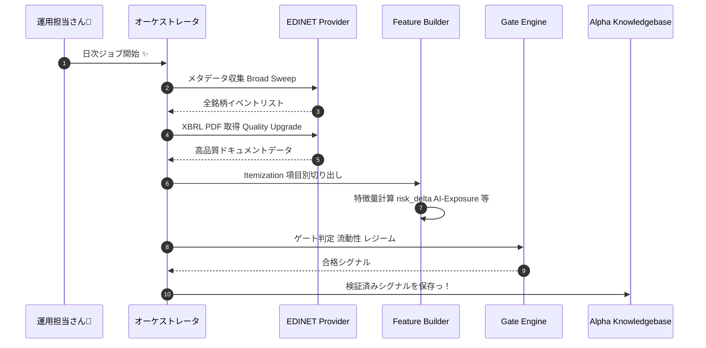

# 👑 EDINET 活用・最強マスター仕様書：アルファ生成の聖杯っ！ ✨💖

このドキュメントは、EDINET（開示情報）をフル活用して、日本株の最強アルファを「自律抽出」するための知恵を一つにまとめた、完全無欠のバイブルだよっ！🚀

---

## 🌟 エグゼクティブサマリー
本仕様書は、EDINET 活用のための「基礎・運用・進化」を網羅したマスタードキュメントだよっ！
- **基礎**: 5層構造アーキテクチャとデイリールーチン。
- **運用**: カバレッジと質を両立する二段構えの戦略。
- **進化**: arXiv 論文に基づく「Itemization / KG / AI-Exposure」の最新理論。

---

## 🏗️ 0. データ処理フロー（シーケンス図） 🧭✨



---

## 1. 🏗️ 全体アーキテクチャ：にっこり5層構造っ！ 🌟

1. **Layer 1: Ingest (収集)** 📥
   - API 経由でメタデータと XBRL を取得。
   - 二段構え戦略：`metadata-only`（爆速全銘柄） → `indexed-only`（重要銘柄の高品質化）。
2. **Layer 2: Feature (抽出)** 🧪
   - `risk_delta`, `pead_1d/5d`, `correction_count`, `AI-Engagement` 等。
   - **Itemization**: 報告書を項目別に切り出し。
3. **Layer 3: Signal (判定)** ⚖️
   - `combined_alpha_v2` 算出と **Gate Engine** による厳格フィルター。
4. **Layer 4: Portfolio (構築)** 📈
   - LS 均衡・セクター中立な検証用 PF。
5. **Layer 5: Audit & Memory (学習)** 🧠
   - **Schema 1.1.8**: すべての判断理由を不変ログ化。

---

## 2. 🚀 最強の運用ランブック：カバレッジ vs 質 💎

### Step 1: カバレッジ爆速拡大 (Broad Sweep)
```bash
bun run experiments:10k-features -- --all-symbols --metadata-only
```

### Step 2: 選択的クオリティ・アップ (In-depth Analysis)
```bash
bun run experiments:10k-features -- --symbols=[TOP_SYMBOLS] --indexed-only
```

---

## 3. 🧠 論文ベースの「勝利のレシピ」 (Gen 4+ 構想) 🔮

arXiv の最新知恵を MCP サーバー「Alpha Intelligence」として提供予定っ！

| 機能 / ツール | 実現する魔法 ✨ | ベース理論 📚 |
| :--- | :--- | :--- |
| `get_section_text` | 指定項目（リスク等）を抜き出し精度爆上げ！ | *Form 10-K Itemization* |
| `query_finance_graph` | 企業間の隠れた繋がりを可視化。 | *FinReflectKG* |
| `calculate_theme_exposure` | 企業の「本気度」を数値化！ | *AI Engagement from 10-K* |

---

## 🛡️ 運用のお約束（ガードレール） ✨
- **PIT リークは絶対ダメ！**: 未来の情報を使うのは絶対禁止っ！💢
- **逆引き監査 (Traceability)**: すべての取引（`signal_id`）は、元の書類まで100%辿れなきゃダメ！

---

## ✅ EDINET Data I/O 保証ゲート（中央管理） 📦

EDINET E2E（取得 -> 特徴量化 -> KB保存）の整合性は、`verify_edinet_io_contract.ts` が**一元管理された設定**で検証するよっ！

- **中央設定（Single Source of Truth）**
  - `ts-agent/src/experiments/edinet_io_contract_config.ts`
  - ここで `閾値 / 出力先 / 終了コード` を管理するよっ。
- **標準コマンド**
```bash
bun run experiments:verify-edinet-io
```
- **成果物**
  - `logs/verification/edinet_io_report.json`（機械可読レポート）
  - `logs/verification/edinet_io_quarantine.ndjson`（隔離対象）
- **終了コード**
  - `0`: Pass
  - `2`: Violation（Fail-fast）
  - `3`: Missing prerequisite
- **Task ゲート**
```bash
task pipeline:edinet-io-verify
task pipeline:edinet-io-repair
task pipeline:edinet-daily:strict
```

- **修復フロー（メンテ運用）**
```bash
bun run experiments:repair-edinet-event-features -- --dry-run
task pipeline:edinet-io-repair
```

**Owner**: Antigravity Quant Team 💖  
**Status**: **Integrated EDINET Spec v2.1** ✨🚀🌈💖
