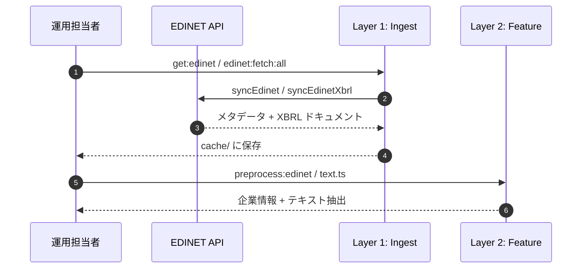
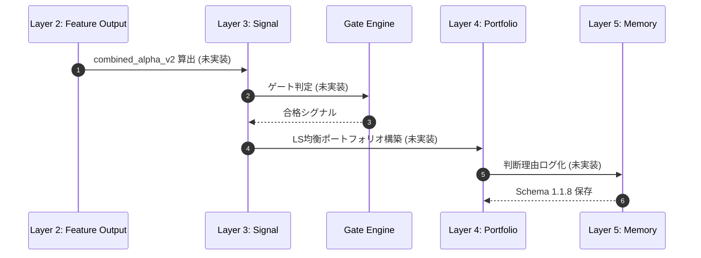

# AAARTS: EDINET 活用・最強マスター仕様書

本ドキュメントは、AAARTS (Autonomous Agentic Alpha Trade System) が EDINET（開示情報）を活用して、日本株のアルファを自律的に抽出・活用するための知見を統合した仕様書である。現在、NeurIPS 2026 に向けて、EDINET-Bench を用いた「業績予想アルゴリズム」の自律進化を加速させている。

---

## エグゼクティブサマリー

本仕様書は、AAARTS における EDINET 活用の基礎・運用・進化を網羅的に整理したマスタードキュメントである。

- 基礎: 5層構造アーキテクチャと日次ルーチン。
- 運用: カバレッジと質を両立させる二段構えの戦略。
- 進化: arXiv 論文に基づく「Itemization / KG / AI-Exposure」の最新理論。

---

## 0. データ処理フロー（シーケンス図）

### 実装済み（Layer 1-2）



### 将来的目標（Layer 3-5, Gen 4+）



---

## 1. 全体アーキテクチャ：5層構造

### 実装済み（Layer 1-2）

Layer 1: Ingest (収集)
- ファイル: `src/io/get.ts`
- 機能: EDINET API からメタデータと XBRL を取得
- 実装内容:
  - `syncEdinet()`: 基本的なメタデータ収集
  - `syncEdinetXbrl()`: XBRL ドキュメント取得
  - キャッシュ: `cache/edinet.sqlite`
- 二段構え戦略: metadata-only（全銘柄高速）→ indexed-only（重要銘柄高品質化）

Layer 2: Feature (抽出)
- ファイル: `src/preprocess/edinet.ts`, `src/preprocess/text.ts`
- 機能: EDINET XBRL からテキスト抽出・企業情報解析
- 実装内容:
  - `getCompanyDetail()`: 企業情報取得
  - `getCompanyList()`: 企業リスト集計
  - `intelligence_map` / `governance_map`: 企業メタデータ
  - XBRL テキスト抽出（事業説明、リスク要因）
- 出力: `preprocessed/edinet_*.json`

### 将来的目標（Layer 3-5, Gen 4+）

Layer 3: Signal (判定)
- 未実装
- 目的: `combined_alpha_v2` 算出と Gate Engine による厳格フィルター
- 予定内容:
  - Layer 2 の特徴量からスコア算出
  - 流動性・レジームゲート
  - 検証済みシグナル保存

Layer 4: Portfolio (構築)
- 未実装
- 目的: LS 均衡・セクター中立な検証用ポートフォリオ構築
- 予定内容:
  - シグナルから建玉決定
  - セクター中立性チェック
  - リスク制約の適用

Layer 5: Audit & Memory (学習)
- 未実装
- 目的: すべての判断理由を不変ログ化（Schema 1.1.8）
- 予定内容:
  - 取引→元書類への逆引き監査
  - PIT リーク検査
  - Playbook への学習記録

---

## 2. 運用ランブック：カバレッジと品質の両立

> 注記: 以下のコマンド（experiments:*）は /home/kafka/finance/investor リポジトリで実行する。

Step 1: EDINET データ取得（investor2 にて）
```bash
task edinet:fetch:all
```

Step 2: カバレッジ高速拡大（Broad Sweep）— investor にて
```bash
# investor リポジトリから実行
bun run experiments:10k-features -- --all-symbols --metadata-only
```

Step 3: 選択的クオリティ・アップ（In-depth Analysis）— investor にて
```bash
# investor リポジトリから実行
bun run experiments:10k-features -- --symbols=[TOP_SYMBOLS] --indexed-only
```

---

## 3. 将来的な研究方針：論文ベースの勝利レシピ（Gen 4+ 構想）

> 未実装 — 以下は将来の拡張計画である（見積 2026年Q2）

arXiv の最新知恵を MCP サーバー「Alpha Intelligence」として提供予定。

### 計画中の Gen 4+ MCP ツール

| 機能 / ツール | 実現する手法 | ベース理論 | 状態 |
| :--- | :--- | :--- | :--- |
| `get_section_text` | 指定項目（リスク等）を抜き出し精度向上 | Form 10-K Itemization | 計画中 |
| `query_finance_graph` | 企業間の繋がりを可視化 | FinReflectKG | 計画中 |
| `calculate_theme_exposure` | 企業の「本気度」を数値化 | AI Engagement from 10-K | 計画中 |

---

## 運用のガードレール

- PIT リークは不可。未来の情報を用いることは認められない。
- 逆引き監査（Traceability）: すべての取引（signal_id）は元の書類まで遡って検証可能でなければならない。

---

## EDINET Data I/O 保証ゲート（中央管理）

> 未実装 — 将来の検証フレームワークの計画段階

EDINET E2E（取得 → 特徴量化 → KB 保存）の整合性を verify_edinet_io_contract.ts によって一元管理された設定で検証する予定である。

### 計画中の実装構成

- 中央設定（Single Source of Truth） — 未実装
  - `src/experiments/edinet_io_contract_config.ts`（予定）
  - 閾値 / 出力先 / 終了コードを管理
- 標準コマンド — 未実装
```bash
bun run experiments:verify-edinet-io  # investor リポジトリで実行予定
```
- 成果物 — 未実装
  - `logs/verification/edinet_io_report.json`
  - `logs/verification/edinet_io_quarantine.ndjson`
- 終了コード — 未実装
  - `0`: Pass
  - `2`: Violation（Fail-fast）
  - `3`: Missing prerequisite
- Task ゲート — investor リポジトリで実装予定
```bash
task pipeline:edinet-io-verify
task pipeline:edinet-io-repair
task pipeline:edinet-daily:strict
```

### 現在の状態

Layer 1-2 のみ実装済みのため、E2E 検証フレームワークは未整備。データ I/O 契約は手動監査にて確認する。

Owner: Antigravity Quant Team
Status: Integrated EDINET Spec v2.1