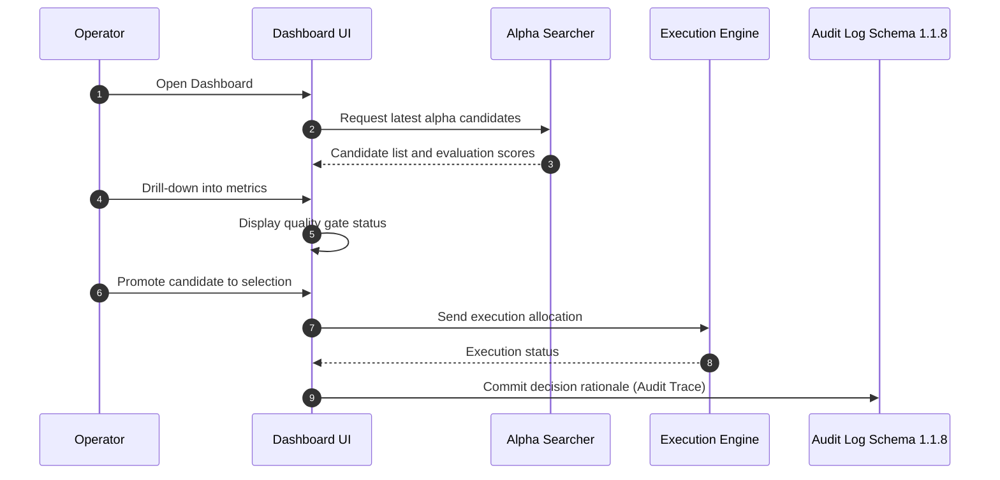
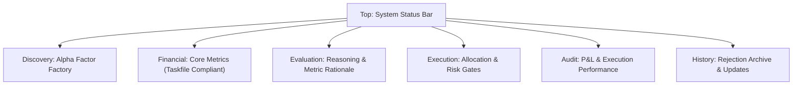
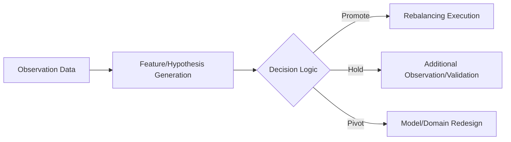
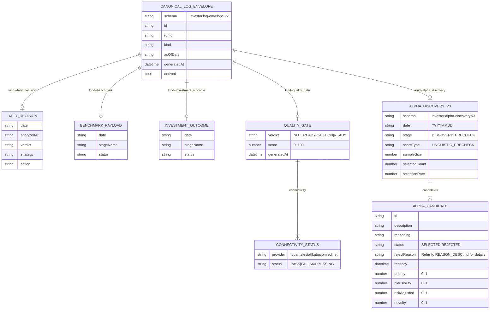
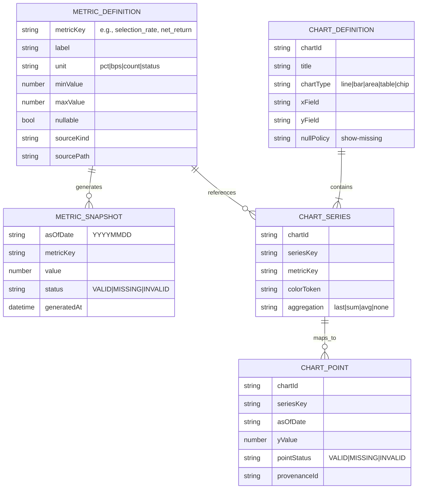

# Operational Governance Dashboard Specification

**Objective**: Ensure decision-making quality and safety in autonomous trading through comprehensive observability and control.
**Context**: To address concerns regarding alpha validity, adherence to trading rules, and traceability of decision reasoning.

## Executive Summary
This dashboard leverages advanced reasoning capabilities (Gemini 3.0 Pro) to visualize the end-to-end alpha discovery lifecycle—from candidate identification to execution and auditing. Built with `Strict TypeScript` and `Zod`, it ensures high-quality data integration to mitigate risk and maintain operational integrity.

---

## 1. Objectives
The dashboard provides three primary functional layers for operational control:

- **Rapid Candidate Selection**: Evaluate and filter newly discovered alpha factors.
- **Reliable Execution Control**: Enforce trading rules and risk limits during deployment.
- **Comprehensive Audit Trace**: Record all decision rationales to ensure full traceability.

## 2. Personas
- **Operational Manager**: PMs, Risk Managers, and Team Leads responsible for system oversight.
- **Trading Desk**: Operators responsible for execution monitoring and manual intervention.
- **Compliance & Audit**: Officers responsible for verifying regulatory and internal rule adherence.

## 3. Core Principles
- **Total Visibility**: A single unified view for all critical system states.
- **Process Integrity**: Forced adherence to the Discovery -> Evaluation -> Execution -> Audit sequence.
- **Evidence-Based**: Distinction between raw data metrics and model-based reasoning.
- **Rejection Archival**: Mandatory recording of rejection rationales for all non-selected candidates.
- **Pre-Trade Validation**: Hard gates for risk limits and circuit breakers prior to order execution.
- **Granular Traceability**: Direct drill-down from UI metrics to source-level logs.

## 4. Operational Sequence (Workflows)

## 5. UI Layout Structure

## 6. Functional Sections

### 6.1 Status Bar
- Visual indicator for system "Vitality" (Active/Suspended).
- Real-time alerts for anomaly detection and timestamp of last data heartbeat.

### 6.2 Alpha Discovery View
- Displays `Expected Alpha` and `Recency` of new candidates.
- Prioritization based on proprietary score with "MISSING" indicators for incomplete inputs.

### 6.3 Financial Metrics View (FINANCIAL Tab)
- Truthful representation of `task run` outputs without ad-hoc interpolation.
- KPI Cards: `gross_return`, `net_return`, `total_cost_bps`, `fee_bps`, `slippage_bps`, `sharpe_ratio`, `max_drawdown`, `volatility`, `cagr`, `win_rate`, `profit_factor`, `information_ratio`, `information_coefficient`.
- Charts: Dual-axis comparison of `net_return` and `basket_daily_return`.
- Tabular data for stage-specific metrics (`benchmark`, `investment_outcome`).

### 6.4 Quantitative Evaluation View
- Benchmarking of `Sharpe`, `MDD`, and other ratios against defined targets.
- Visual comparative analysis of "Target" vs. "Actual" performance.

### 6.5 Execution Management View
- Symbol-level `Allocation` suggestions.
- Hard-coded logic to block orders exceeding risk budgets or positional limits.
- `Kill Switch` for immediate order cancellation and发注 suspension.

### 6.6 Performance Audit View
- Realized P&L tracking and cumulative return visualization.
- slippage analysis and fill-rate auditing to evaluate execution quality.

### 6.7 History & Rejection View
- Historical archive of rejection reasons for non-selected alpha.
- Audit log of parameter updates and configuration changes (User Attribution).

## 7. Key Features
1. **Candidate Scoring**: Rank-ordered alpha discovery results.
2. **Financial KPI Visualization**: Comprehensive Return/Risk/Cost/Efficiency metrics.
3. **Benchmark Comparison**: Real-time delta between targets and results.
4. **Rejection Factor Management**: Data-driven tracking of rejection rationales.
5. **Dynamic Allocation Suggestions**: Risk-budgeted allocation proposals.
6. **Pre-Trade Control**: Guardian logic to prevent rule-violating orders.
7. **Kill Switch**: Instant suspension of all execution capabilities.
8. **P&L Auditing**: Real-time and realized loss/profit tracking.
9. **Execution Quality Analytics**: Quantitative analysis of implementation shortfall.
10. **Data Traceability**: Direct link from dashboard metrics to audit logs.
11. **Parameter Change Log**: Immutable record of operational rule updates.
12. **Status Management**: 3-stage lifecycle for strategy state (Research, Staging, Active).
13. **Classification Management**: Clear separation between committed and forecasted data.

## 8. Monitored Indicators
- **Expected Return**: `Expected Alpha`
- **Realized P&L**: `Realized P&L`
- **Maximum Drawdown**: `Maximum Drawdown`
- **Volatility**: `Volatility`
- **Allocation Ratio**: `Allocation Ratio`
- **Slippage**: `Implementation Shortfall`
- **Turnover**: `Turnover`

## 9. UI/UX Standards
- **3-Click Rule**: Critical operations must be accessible within 3 interactions.
- **Modal-less Verification**: Seamless drill-down without context switching.
- **Safety First**: Perpetual visibility and access to the Emergency Kill Switch.

## 10. Data Governance Rules
- **Real-Time Threshold**: Data latency must not exceed 60 seconds.
- **Absolute Integrity**: No interpolation for missing data. Display as "MISSING".
- **Immutability**: Historical records are write-once, read-many (Immutable).
- **Missing Value Policy**: Explicit use of `MISSING` or `INVALID`. No ad-hoc use of `0` or `UNKNOWN`.
- **Error Visibility**: Silent failures are prohibited. Data contract violations must be surfaced on-device.

## 11. Acceptance Criteria
- End-to-end alpha discovery-to-selection workflow must reside within the dashboard.
- All candidate rejections must be traceable to defined rationales.
- Pre-trade risk gates must be mandatory and non-bypassable.
- Every metric must be traceable to its original raw log event.
- Strategy state must be explicitly managed through the 3-stage lifecycle.

## 12. Strategy Selection Logic

## 13. Roadmap
1. Prototype core dashboard (Summary, Discovery, Evaluation).
2. Implement Risk Guardian (Execution Gateway Control).
3. Finalize Performance Audit and History management layers.
4. Validate compliance with all defined acceptance criteria.

## 14. Data Lifecycle Model (Mermaid)
Dashboard consumes `investor.log-envelope.v2` units, validated by `kind` and schema version.

### 14.1 Operational Integrity Rules
- Do NOT mask missing data with `0` or `UNKNOWN`.
- `Discovery` stage metrics must be strictly isolated from post-backtest metrics.
- Connectivity check results from `quality_gate` are the primary health indicators.
- Schema-violating logs are rejected and flagged as `Data Contract Violations`.

## 15. Metrics and Charting Model
Dual-mode presentation of raw snapshots and aggregated time-series.

### 15.1 Core Metric definitions
- `selection_rate`: Selection efficiency (0..1).
- `net_return`: Realized net return (pct).
- `total_cost_bps`: Aggregate implementation cost (bps).
- `sharpe_ratio`: Risk-adjusted returns (ratio).
- `jquants_status`: Connectivity with J-Quants API (status).

### 15.2 Mandatory `task run` Metrics
Metrics required for the integrated discovery-benchmark-analysis-execution pipeline:
- **Returns**: `gross_return`, `net_return`, `basket_daily_return`, `cumulative_return`, `cagr`.
- **Risks**: `sharpe_ratio`, `max_drawdown`, `volatility`, `win_rate`, `information_ratio`, `information_coefficient`.
- **Costs**: `fee_bps`, `slippage_bps`, `total_cost_bps`.
- **Efficiency**: `expected_edge`, `profit_factor`, `avg_return`, `trading_days`.

## 16. Deprecation Policy
- Only `investor.log-envelope.v2` and higher schemas are supported.
- Legacy `readiness` indicators are deprecated in favor of `quality_gate`.
- Programs masking errors or bypassing data contract validations are strictly prohibited.
- Detected contract violations must be surfaced in the `Data Contract Violations` view.
